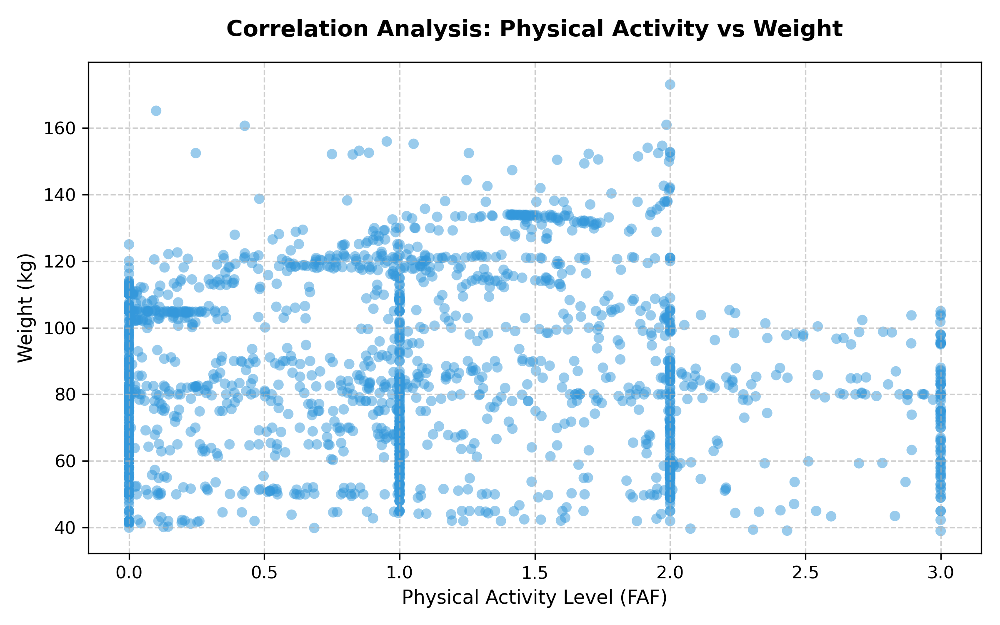

# 📊 E-Health Data Pipeline: Obesity Behavioral Risk Analysis

This repository contains an end-to-end data analytics project combining **SQL Server** for structural cleaning and **Python** for statistical modeling and visualization.

## 🧠 Project Architecture & Workflow
1. **Database Layer (SQL Server):** Consolidated messy electronic health records into a clean, unified view (`v_obesity_cleaned`).
2. **Data Pipeline (Pandas):** Implemented a parsing engine capable of fixing regional formatting issues (comma-to-dot decimal conversions) and automated feature engineering.
3. **Statistical Rigger (SciPy):** Conducted hypothesis testing to validate the biological significance of behavioral metrics.

---

## 🔍 Key Exercises & Scientific Findings

### 📍 Multi-Variate Logic (Exercise 7)
Patients were classified into lifestyle risk categories using cross-examined conditions based on daily Screen Time (`TUE`) and Water Intake (`CH2O`):
* **Balanced Profile:** Optimized habits ($\le$ 2h screens **AND** $\ge$ 2L water).
* **Moderate Risk:** Suboptimal habits (> 2h screens **OR** < 2L water).

### 📍 Correlation Analysis (Exercise 10)
We plotted Physical Activity Levels (`FAF`) against total `Weight_kg` using a custom scatter plot to track density distribution and behavior impacts:

### 📍 Rigorous T-Testing (Exercise 11)
To prove our behavioral profiling wasn't just a product of random variance, a **Welch's T-Test** was executed to compare the average weights of our cohorts.

* **Average Weight (Balanced Profile):** 88.53 kg
* **Average Weight (Moderate Risk):** 83.20 kg
* **Calculated P-Value:** $7.10 \times 10^{-6}$ (0.0000071)

👉 **Scientific Conclusion:** Since the $p\text{-value} < 0.05$, the weight discrepancy between behavioral profiles is **highly statistically significant**. The lifestyle classification engine effectively captures distinct biological cohorts, completely ruling out random chance.

---

## 🛠️ Tech Stack
* **SQL** (MSSQL / SSMS)
* **Python 3** (Pandas, Matplotlib, SciPy)